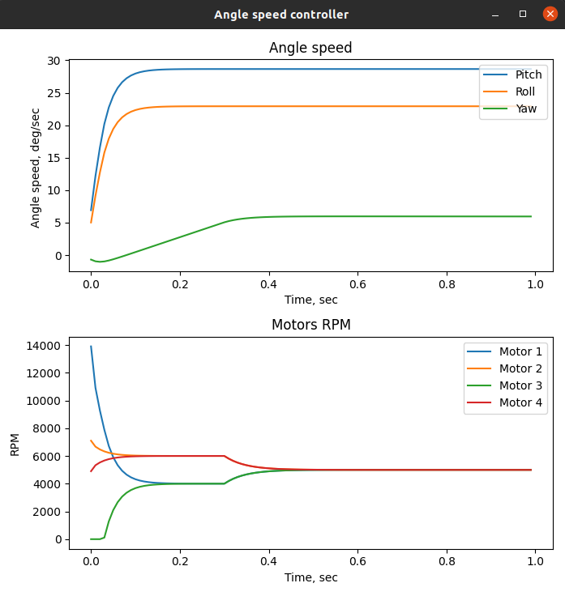

# Quadcopter Angular Speed Sontroller

This model describes a quadrocopter angular velocity control system.
The first plot describe the values of the angular speed by the Roll, Pitch and Yaw.
The second plot describe the values of the RPM of each motor

## Program rewiew

### Lets start from math modelling:

The quadrocopter in space is controlled by the different throttle of each motor. Throttle force produced moment, that call quadcopter rotation 
around X Y and Z axis. In python it seems like this:

        M0 = ((w[0] * pow(b, 2)) * length / 2)  # moment of first motor
        M1 = ((w[1] * pow(b, 2)) * length / 2)  # moment of second motor    
        M2 = ((w[2] * pow(b, 2)) * length / 2)  # moment of third motor
        M3 = ((w[3] * pow(b, 2)) * length / 2)  # moment of fourth motor
        Mz = d * (pow(w[3], 2) + pow(w[1], 2) - pow(w[0], 2) - pow(w[2], 2))  #gyro moment of all motors
        
We are used to counting items starting from one, but motors should be counted from zero. First four strings calculates moment of every engine.
different moment on different sides of quadcopter produces rotation around X and Y axis, we call it Pitch and Roll.
However, with the Z axis, everything is more complicated. There are important different values of RPM of motors that rotate clockwise and counterclockwise. If clockwrise rotated motors rotate faster than counterclockwise motors, quadcopter starts rotate counterclockwise. d is special ratio that depends on quadcopter construction.

        Ax = (M0 + M1 - M2 - M3) / inert  # calculate X axis acceleration
        Wx_cur += Ax * dt  # calculate X axis angle speed
        
        Ay = (M0 + M3 - M1 - M2) / inert  # calculate Y axis acceleration
        Wy_cur += Ay * dt  # calculate Y axis angle speed
        
        Az = Mz / inert  # calculate Z axis acceleration
        Wz_cur += Az * dt  # calculate Z axis angle speed
        
Angular acceleration we can find like Moment/inertia moment. Because we write discret system we have sampling frequency that we called dt, so we can
integrate the angular acceleration and get the angular speed like this.  

### Mixer system 

Okay, but it is difficult for us to control each motor separately. Lets write control system. 

let's say we have some command like "to set the angular acceleration to N, you need do throttle to M" and each expression for Roll and Yaw. Then we need command mixer. Depending on the location of the motors on the frame, we give different commandd for different frame sides. P-des is throttle value which we use to control the lifting force.

         w[0] = saturation(P_cmd - Yaw_cmd + Roll_cmd + Pitch_cmd, 20000, 0)  #Top left motor
         w[1] = saturation(P_cmd + Yaw_cmd - Roll_cmd + Pitch_cmd, 20000, 0)  #Top right motor
         w[2] = saturation(P_cmd - Yaw_cmd - Roll_cmd - Pitch_cmd, 20000, 0)  #Bottom right motor
         w[3] = saturation(P_cmd + Yaw_cmd + Roll_cmd - Pitch_cmd, 20000, 0)  #Bottom left motor 

As you can see, to turn the quadcopter by roll clockwrise we need to increase throttle on the left side and decrease on the right side. To turn quadcopter by pitch clockwrise we need to increase throttle on the top side and decrease on the bottom side. To turn quadcopter by yaw we need to increase throttle on the motors, that rotate counterclockwise, and decrease on the mototrs, that rotate clockwrise. In general, it is enough to change the thrust on only one side to turn, but we change the thrust on two sides to speed up the process and ensure the same lifting force. "Sturation" function we need to ensure realistic modelling process - there is motor cant rotate faster than 20k RPM ad cant change direction of rotating.

        
         def saturation(var, max, min):
                if var > max:
                        return max
                 elif var < min:
                        return min
                else:
                        return var

Good, we have command mixer, now lets write control system to associate the mixer command and desire angular speed, because our command value is just motors RPM.

### Control system

In fact, this is the simplest part. We just use PID controller to calculate necessary motors RPM command. Then we saturate this command to ensure realistic modelling - quadcopter cant rotate too fast, it can broke. This system will allow us to accurately and smoothly provide the required angular velocity.

        Wx_input_parameters = [100, 0.001, 0.1, Wx_des, Wx_cur, Wx_old_error, Wx_sum_error, dt]
        Wx_impact = PID(Wx_input_parameters)  # calculate X axis impact
        Pitch_cmd = saturation(Wx_impact, 500, 0)

        Wy_input_parameters = [100, 0.001, 0.1, Wy_des, Wy_cur, Wy_old_error, Wy_sum_error, dt]
        Wy_impact = PID(Wy_input_parameters)  # calculate Y axis impact
        Roll_cmd = saturation(Wy_impact, 500, 0)

        Wz_input_parameters = [500, 1, 1, Wz_des, Wz_cur, Wz_old_error, Wz_sum_error, dt]
        Wz_impact = PID(Wz_input_parameters)  # calculate Z axis impact
        Yaw_cmd = saturation(Wz_impact, 10, -10)

Wx_input_parameters is PID regulator parameters

         Wx_input_parameters = [Kp, Ki, Kd, Wx_desire, Wx_current, Wx_old_error, Wx_sum_error, dt]

To find out what these coefficients mean let's look at the pid controller.

### PID regulator

PID controller is abstract part of control system that ensure required type of transition process. in simple words, it changes some value as we want - quickly, slowly, accurately or not very much. First, we just get the variables from the list - these are the features of working with python. Then we calculate controlling error, it will need us soon. Common PID formula is:

### U = (Kp * Error) + (Ki * Sum_Error) + (Kd * (Error - Old_Error)/dt)

What are derivatives, integrals, what are control errors and regulator kicks for, you can read here:

In Russian - https://alexgyver.ru/lessons/pid/

In English - https://www.electricaltechnology.org/2015/10/what-is-pid-controller-how-it-works.html 

We are interested in the effect of discreteness, thanks to it we can calculate derivatives and integrals like that

### Integral = Sum(Value_on_each_cycle * sampling_time)
### Derivative = (Value_on_this_Cycle - Value_on_past_Cycle) / sampling_time

So, we just calculate the impact and return it.

    def PID(pid_input_parameters):  # [kp,ki,kd, setpoint, currentpoint, old_error, sum_error,dt]

            # variables definition
            kp = pid_input_parameters[0]
            ki = pid_input_parameters[1]
            kd = pid_input_parameters[2]
            setpoint = pid_input_parameters[3]
            currentpoint = pid_input_parameters[4]
            old_error = pid_input_parameters[5]
            sum_error = pid_input_parameters[6]
            dt = pid_input_parameters[7]

            # calculate PID impact
            error = setpoint - currentpoint
            impact = kp * error + kd * ((error - old_error) / dt) + ki * sum_error

            return impact

Because this function work with one step, we need to remember old error and sum of errors in main function. Yes, it is inconvenient, but it allows us to implement a universal pid controller function for all cases. 

            Wx_sum_error += (Wx_des - Wx_cur)  # calculate sum of errors 
            Wx_old_error = Wx_des - Wx_cur  #calculate and remember old error
            
### Сonclusions

A mathematical model of the angular velocity control system for a quadrocopter is implemented.

Another code is needed for plots drewning and unimportant functional. 

### Should be noted
This is a very simple system that does not take into account many factors, such as:
- engine operation processes - the system considers that their value can change instantly
- air resistance when moving
- integration errors in real implementation detection systems
However, in this variant, it describes the operation of the "air" modes quite fully. In a real drone, the integration system will be replaced by working with the interface of the MEMS accelerometer and MEMS angular velocity sensor, which will also return linear and angular accelerations.

if you want to see the operation of the PID controller in more detail, you can use my simulator - https://github.com/der-rozanov/PID_Simulation 
there you can manually evaluate the impact of each coefficient on the final result.
